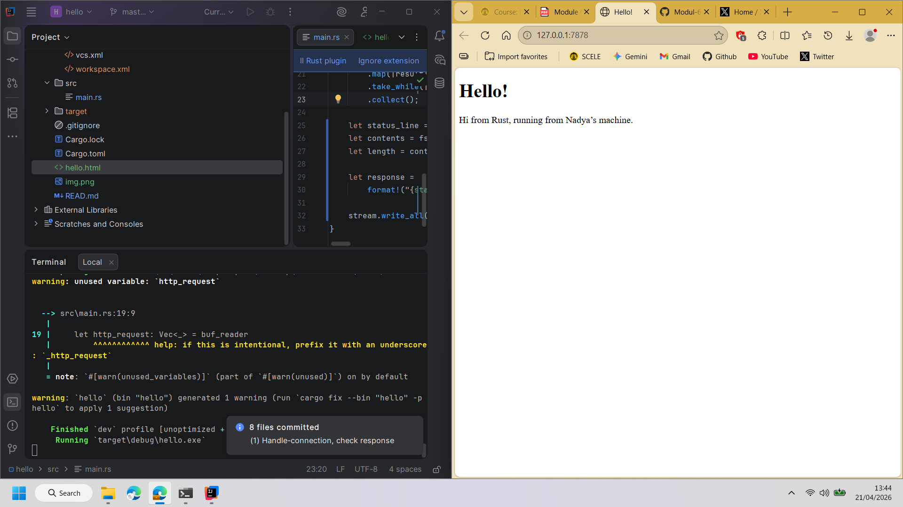
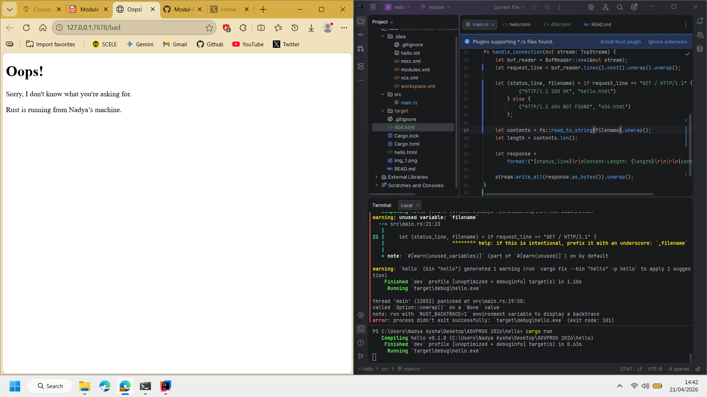

# Reflection Notes - Modul 6 Concurrency

## Commit 1 Reflection Notes

Dalam fungsi `handle_connection`, terdapat beberapa hal yang terjadi untuk memproses koneksi yang masuk.
Pertama, ada **BufReader**, ini untuk membungkus `TcpStream` ke dalam `BufReader`. Ini dilakukan untuk meningkatkan efisiensi pembacaan data. Dibandingkan membaca data byte-per-byte langsung dari stream, `BufReader` melakukan manajemen buffer di memori.
Kedua, ada **.lines()** untuk membagi aliran data/ stream menjadi baris-baris teks berdasarkan karakter *newline*.
Ketiga, ada **.map(|result| result.unwrap())**, karena setiap baris hasil pembacaan bisa saja gagal/ error, kita melakukan `unwrap` untuk mengambil string aslinya.
Keempat, ada **.take_while(|line| !line.is_empty())**, ini adalah HTTP Request yang selalu diakhiri dengan baris kosong. Kode ini memberitahu program untuk berhenti membaca setelah menemukan baris kosong tersebut agar tidak menunggu selamanya.
Terakhir, ada **.collect()** yang mengumpulkan semua baris teks yang telah diproses ke dalam sebuah Vector (`Vec<_>`).

## Commit 2 Reflection Notes

Perbedaan utamanya terletak pada kemampuan server untuk memberikan **umpan balik (response)** kepada klien. Jika sebelumnya fungsi hanya membaca dan mencetak isi *request* ke terminal, versi terbaru ini sudah bertindak sebagai web server fungsional yang membaca file fisik `hello.html`, menyusunnya ke dalam format protokol HTTP yang benar (lengkap dengan *status line* dan *header* `Content-Length`), lalu mengirimkan data tersebut kembali melalui jaringan menggunakan `stream.write_all`. Dengan perubahan ini, browser yang mengakses alamat server tersebut kini dapat merender dan menampilkan halaman HTML secara visual, bukan sekadar mengirim data ke ruang hampa.

## Commit 3 Reflection Notes

Milestone ini menerapkan validasi path request untuk memisahkan respons antara status `200 OK` (halaman valid) dan `404 NOT FOUND` (halaman tidak tersedia) menggunakan struktur `if/else`. Melalui *refactoring* berbasis prinsip **DRY**, logika pembacaan file dan pengiriman data diringkas agar tidak berulang, sehingga kode menjadi lebih bersih, mudah dipelihara, dan efisien karena penentuan status serta nama file dipisahkan dari proses eksekusi pengiriman responsnya.

